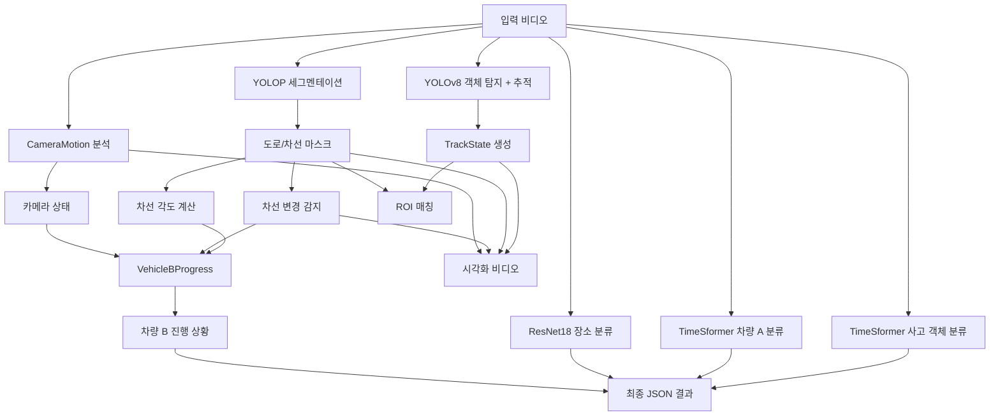

# Run.py 최종 파이프라인 문서

## 개요

`run.py`는 교통사고 영상을 분석하여 다음을 수행하는 통합 파이프라인입니다:
- 객체 탐지 및 추적 (YOLO + ByteTrack)
- 도로/차선 세그멘테이션 (YOLOP)
- 사고 객체 분류 (TimeSformer)
- 사고 장소 분류 (ResNet18)
- 차량 A 진행 상황 분류 (TimeSformer)
- 차량 B 진행 상황 추론 (VehicleBProgress)
- 카메라 흔들림 감지 (CameraMotion)
- 차선 변경 감지 (LaneChange)

---

## 실행 방법

### 기본 사용법

```bash
python run.py --video <video_path>
```

### 전체 옵션

```bash
python run.py \
  --video <video_path> \
  --weights yolo_trained/yolov8n.pt \
  --tracker bytetrack.yaml \
  --save_video output/result_tracked.mp4 \
  --save_json output/result_trajectories.json \
  --conf 0.3 \
  --iou 0.5 \
  --roi yolop
```

### 인자 설명

| 인자 | 타입 | 기본값 | 설명 |
|------|------|--------|------|
| `--video` | str | **필수** | 입력 비디오 경로 |
| `--weights` | str | `yolo_trained/yolov8n.pt` | YOLO 모델 가중치 경로 |
| `--tracker` | str | `bytetrack.yaml` | 추적 알고리즘 설정 (bytetrack/strongsort) |
| `--save_video` | str | `output/{video_name}_tracked.mp4` | 출력 비디오 경로 (자동 생성) |
| `--save_json` | str | `output/{video_name}_trajectories.json` | 출력 JSON 경로 (자동 생성) |
| `--conf` | float | `0.3` | 객체 탐지 신뢰도 임계값 |
| `--iou` | float | `0.5` | NMS IoU 임계값 |
| `--roi` | str | `yolop` | ROI 추출 방법 (none/yolop) |

---

## 파이프라인 구조

### 1. 초기화 단계

#### 1.1 비디오 메타데이터 추출
```python
video_name = "bb_1_010806_two-wheeled-vehicle_148_275.mp4"
# 파싱 결과:
# - filming_way: "bb" (블랙박스)
# - video_date: "010806" (yymmdd)
```

#### 1.2 모델 로딩

| 모델 | 용도 | 가중치 경로 | 출력 클래스 수 |
|------|------|-------------|---------------|
| **YOLOv8** | 객체 탐지 | `yolo_trained/yolov8n.pt` | - |
| **YOLOP** | 도로/차선 세그멘테이션 | 내장 | 2 (road, lane) |
| **TimeSformer (obj)** | 사고 객체 분류 | `ckpts/best_obj.ckpt` | 4 |
| **TimeSformer (veh)** | 차량 A 진행 분류 | `ckpts/best_vehi.ckpt` | 9 |
| **ResNet18** | 사고 장소 분류 | `ckpts/best_resnet18_place.pth` | 13 |

#### 1.3 엔진 초기화

**CameraMotion** (카메라 흔들림 감지)
```python
CameraMotion(
    fps=fps,
    ema=0.9,           # 지수 이동 평균 계수
    trans_thr=5.5,     # 이동 임계값
    rot_thr_deg=2.2,   # 회전 임계값 (도)
    cool=20            # 쿨다운 프레임 수
)
```

**LaneChange** (차선 변경 감지)
```python
LaneChange(
    persist=8,         # 지속 프레임 수
    cooldown=20,       # 쿨다운 프레임 수
    delta_thr=0.08     # 변화 임계값
)
```

**VehicleBProgress** (차량 B 진행 상황 추론)
```python
VehicleBProgress(
    fps=30,
    tau_deg=6,         # 회전 민감도 (12→6으로 증가)
    v_stop=0.25,       # 정지 속도 임계값 (0.15→0.25)
    dv_start=0.15,     # 출발 가속도 임계값 (0.3→0.15)
    n_stop=6,          # 정지 판단 프레임 수 (10→6)
    n_start=4,         # 출발 판단 프레임 수 (6→4)
    cooldown=15        # 쿨다운 프레임 수 (20→15)
)
```

---

### 2. 프레임별 처리 루프

각 프레임에 대해 다음 단계를 수행합니다:

#### 2.1 카메라 모션 분석
```python
shake_evt, cam_state = cam_engine.update(frame_idx, frame)
```
- **입력**: 프레임 인덱스, 프레임 이미지
- **출력**: 
  - `shake_evt`: 카메라 흔들림 이벤트 (있을 경우)
  - `cam_state`: 카메라 상태 정보

#### 2.2 도로/차선 세그멘테이션 (YOLOP)
```python
roi_masks = yolop(frame)  # {"road": mask, "lane": mask}
road = to_bool(frame, roi_masks["road"])
lane = to_bool(frame, roi_masks["lane"])
```
- **입력**: 프레임 이미지
- **출력**: 
  - `road`: 도로 영역 이진 마스크
  - `lane`: 차선 영역 이진 마스크

#### 2.3 차선 변경 감지
```python
lc_evt = lane_engine.update(frame_idx, lane)
```
- **입력**: 프레임 인덱스, 차선 마스크
- **출력**: 차선 변경 이벤트 (있을 경우)

#### 2.4 차선 각도 계산 및 차량 B 진행 상황 업데이트
```python
phi = lane_main_angle_deg(lane)
pred = bprog_engine.update(frame_idx, cam_state, phi, lane_change_evt=lc_evt)
```
- **입력**: 프레임 인덱스, 카메라 상태, 차선 각도, 차선 변경 이벤트
- **출력**: 차량 B 진행 상황 예측 결과

#### 2.5 객체 탐지 및 추적
```python
for r in yolov8.track(source=args.video, stream=True, ...):
    xyxy = r.boxes.xyxy  # 바운딩 박스
    clss = r.boxes.cls   # 클래스
    conf = r.boxes.conf  # 신뢰도
    ids  = r.boxes.id    # 추적 ID
```

**관심 객체 (INTERESTING)**:
- `0`: person (사람)
- `2`: car (자동차)
- `3`: motorcycle (오토바이)
- `9`: traffic_light (신호등)

#### 2.6 객체별 처리
각 탐지된 객체에 대해:

1. **중심점 및 속도 계산**
```python
cx, cy = xyxy_center(box)
speed = (math.hypot(cx-prev[1][0], cy-prev[1][1]) * fps)
```

2. **TrackState 생성**
```python
t = TrackState(
    tid=tid,
    cls=INTERESTING[c],
    bbox=box,
    center=(cx, cy),
    speed=speed,
    heading=0.0
)
```

3. **ROI 매칭**
```python
match_object_to_roi(track=t, fs=fs)
```
- 객체가 도로/차선 영역에 있는지 판단

4. **궤적 저장**
```python
trajectories[tid].append((frame_idx, (cx, cy), speed))
```

#### 2.7 시각화
- 도로/차선 마스크 오버레이
- 바운딩 박스 및 추적 ID 표시
- 차선 변경 이벤트 표시
- 카메라 흔들림 이벤트 표시

---

### 3. 비디오 레벨 분류 (프레임 루프 종료 후)

#### 3.1 사고 객체 분류
```python
clip = read_video_as_clip(args.video, clip_len=16)
obj_idx, obj_probs = obj_model.predict_single_clip(clip)
```
- **모델**: TimeSformer (best_obj.ckpt)
- **입력**: 16프레임 클립
- **출력**: 사고 객체 클래스 (0~3)

#### 3.2 차량 A 진행 상황 분류
```python
veh_idx, veh_probs = veh_model.predict_single_clip(clip)
```
- **모델**: TimeSformer (best_vehi.ckpt)
- **입력**: 16프레임 클립
- **출력**: 차량 A 진행 상황 클래스 (0~8)

#### 3.3 사고 장소 분류
```python
place_idx, place_probs = place_model.predict_video_frame(args.video, frame_idx=0)
```
- **모델**: ResNet18 (best_resnet18_place.pth)
- **입력**: 비디오의 첫 프레임
- **출력**: 사고 장소 클래스 (0~12)

#### 3.4 차량 B 진행 상황 추출
```python
veh_b_idx = int(pred.get("pred"))
```
- **소스**: VehicleBProgress 엔진의 최종 예측 결과

---

## 출력 형식

### JSON 출력 구조

```json
{
  "video_name": "bb_1_010806_two-wheeled-vehicle_148_275.mp4",
  "video_date": "010806",
  "filming_way": "bb",
  
  "accident_object": 2,
  "accident_place": 5,
  
  "vehicle_a_progress_info": 3,
  "vehicle_b_progress_info": 1,
  
  "raw": {
    "vehicle_b_progress_detail": {
      "pred": 1,
      "state": "moving",
      "speed": 15.3,
      ...
    },
    "events": [
      {
        "type": "camera_shake",
        "frame_idx": 45,
        "intensity": 0.85
      },
      {
        "type": "lane_change_R",
        "frame_idx": 120,
        "balance": 0.123
      }
    ]
  }
}
```

### 필드 설명

| 필드 | 타입 | 설명 |
|------|------|------|
| `video_name` | string | 원본 비디오 파일명 |
| `video_date` | string | 촬영 날짜 (yymmdd) |
| `filming_way` | string | 촬영 방식 ("bb" 또는 "cc") |
| `accident_object` | int | 사고 객체 클래스 (0~3) |
| `accident_place` | int | 사고 장소 클래스 (0~12) |
| `vehicle_a_progress_info` | int | 차량 A 진행 상황 (0~8) |
| `vehicle_b_progress_info` | int | 차량 B 진행 상황 |
| `raw.vehicle_b_progress_detail` | dict | 차량 B 진행 상황 상세 정보 |
| `raw.events` | array | 전역 이벤트 목록 (카메라 흔들림, 차선 변경) |

---

## 데이터 흐름 다이어그램



---

## 주요 컴포넌트 상세

### FrameState

프레임 단위 상태 정보를 담는 데이터 구조:

```python
FrameState(
    idx=frame_idx,           # 프레임 인덱스
    H=H,                     # 프레임 높이
    W=W,                     # 프레임 너비
    road_mask=road,          # 도로 마스크
    lane_mask=lane,          # 차선 마스크
    lane_labels=lane_labels, # 차선 연결 컴포넌트 레이블
    signal_state=None        # 신호등 상태 (미사용)
)
```

### TrackState

객체 추적 상태 정보를 담는 데이터 구조:

```python
TrackState(
    tid=tid,                 # 추적 ID
    cls=INTERESTING[c],      # 객체 클래스명
    bbox=box,                # 바운딩 박스 [x1, y1, x2, y2]
    center=(cx, cy),         # 중심점 좌표
    speed=speed,             # 속도 (픽셀/초)
    heading=0.0              # 방향 (미사용)
)
```

---

## 성능 최적화 팁

1. **GPU 사용**: CUDA가 가능한 환경에서 실행하면 속도가 크게 향상됩니다.
   ```python
   import torch
   print("GPU is", "available" if torch.cuda.is_available() else "not available")
   ```

2. **배치 처리**: 여러 비디오를 처리할 때는 별도의 배치 스크립트 사용을 권장합니다.

3. **ROI 비활성화**: 빠른 테스트가 필요한 경우 `--roi none` 옵션 사용

4. **비디오 저장 생략**: JSON 결과만 필요한 경우 `--save_video` 생략 가능

---

## 문제 해결

### 일반적인 오류

**1. 비디오 열기 실패**
```
RuntimeError: 비디오 열기 실패
```
- 비디오 파일 경로 확인
- 비디오 코덱 지원 여부 확인

**2. 모델 가중치 로딩 실패**
```
FileNotFoundError: [Errno 2] No such file or directory: 'ckpts/best_obj.ckpt'
```
- 모델 가중치 파일 경로 확인
- 필요한 모델 파일이 모두 존재하는지 확인

**3. CUDA 메모리 부족**
```
RuntimeError: CUDA out of memory
```
- 배치 크기 감소
- 비디오 해상도 감소
- CPU 모드로 실행

---

## 관련 문서

- [VehicleBProgress 가이드](VehicleBProgress_GUIDE.md)
- [객체 분류 모델 학습 가이드](training/object_classification.md)
- [장소 분류 모델 학습 가이드](training/place_classification.md)

---

## 업데이트 이력

| 날짜 | 버전 | 변경 사항 |
|------|------|-----------|
| 2025-12-17 | 1.0 | 초기 문서 작성 |
